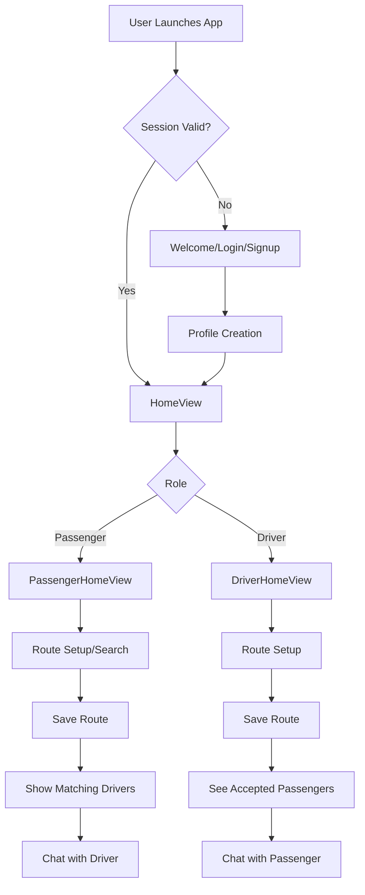

# EasyRide App

## Overview
EasyRide is a Flutter-based ride-sharing platform that connects passengers and drivers by matching their routes. The app supports real-time route calculation, driver-passenger matching, chat, and profile management, using Firebase as the backend.

---

## 🏗️ Architecture & Data Flow

---

## 👤 User Roles
- **Passenger**: Searches and saves a route, views matching drivers, and can chat with drivers.
- **Driver**: Sets up and saves a route, views accepted passengers, and can chat with passengers.

---

## 🔑 Authentication & Profile
- Users sign up or log in using email/phone and password.
- After authentication, users create a profile (role, name, CNIC, images, etc.).
- Session is managed locally for auto-login.

---

## 🚗 Route Creation & Matching
- **Passengers**:
  1. Enter or select start/end locations.
  2. Calculate and save their route.
  3. On the dashboard, see a list of drivers whose routes match theirs (with match percentage).
- **Drivers**:
  1. Enter or select start/end locations.
  2. Calculate and save their route.
  3. On the dashboard, see accepted passengers and their routes.

---

## 🔄 Data Flow Steps
1. **App Launch**: Checks for a valid session and loads the appropriate home view.
2. **Authentication**: Users log in or sign up, then create a profile.
3. **Profile Management**: Users can update their profile and upload images.
4. **Route Setup**:
    - Both drivers and passengers use a map to select and save their route.
    - Route data is stored in Firebase (Firestore).
5. **Matching**:
    - Passengers' routes are compared to all driver routes using road names and geospatial proximity.
    - Matching drivers are shown on the passenger dashboard with a match percentage.
6. **Chat**:
    - Passengers can initiate chat with a matching driver.
    - Drivers can chat with accepted passengers.
7. **Session Management**: User session is stored locally for persistent login.

---

## 📱 Main Screens & Flow
- **Splash/Welcome**: Entry point, session check, login/signup.
- **Profile Creation**: Role selection, personal info, image upload.
- **Home Dashboard**:
  - **Passenger**: Map, saved route, matching drivers list, chat.
  - **Driver**: Map, saved route, accepted passengers, chat.
- **Route Search/Setup**: Map-based route selection and saving.
- **Chat**: Real-time messaging between matched users.

---

## 🗂️ Key Files & Structure
- `main.dart`: App entry, session check, role-based routing.
- `views/`: UI screens (home, search, chat, profile, etc.)
- `services/`: Business logic (Firebase, session, route, location, chat)
- `widgets/`: Reusable UI components (map, sidebar, etc.)
- `models/`: Data models (user, driver, route)

---

## 🔥 Backend
- **Firebase Firestore**: Stores users, routes, and chat data.
- **Firebase Storage**: Stores profile and document images.

---

## 🚦 Data Flow Example (Passenger)
1. Passenger logs in → creates/updates profile.
2. Sets up a route (from/to) and saves it.
3. Dashboard shows matching drivers (with percentage).
4. Passenger can chat with a selected driver.

## 🚦 Data Flow Example (Driver)
1. Driver logs in → creates/updates profile.
2. Sets up a route (from/to) and saves it.
3. Dashboard shows accepted passengers and their routes.
4. Driver can chat with passengers.

---

## 📌 Notes
- All map and route logic is shared and modular for maintainability.
- Matching logic uses both road names and geospatial proximity.
- The app is optimized for both performance and code organization.

---

For more details, see the code in the `lib/` directory and the comments in each file.
